3Dアセットデータ置き場
====

中間ファイル含む 草刈りVR・脱出VRプロジェクト用3Dアセットファイル


## 使い方

"GrassVR"、"EscapeVR"リポジトリにて、

```
git fetch upstream
git merge upstream 3dassets-develop
```

とgitコマンドを入力することで、それぞれのUnityプロジェクトのAssets/3DAssets以下に3Dモデルが追加される。

最新版に更新したい場合も上記のgitコマンドを入力する。

## 各種禁止事項

### developで作業をしている各種スクリプト・オブジェクト作成班の禁止事項

3Dモデル作成担当者以外は

```
git checkout 3dassets-develop
```

をしてはいけない。原則3DAssets内のファイルはいじらない。

### 全体での禁止事項

3dassets-developに他のブランチをマージしてはいけない


## フォルダ構成

```
├─EscapeVR : 脱出VR班用
├─EyeTracking : アイトラッカー班用
│   │  gun.fbx : 銃の3Dモデル
│   │
│   ├─blend : FBXエクスポート前のBlenderファイル置き場
│   └─image : レンダリング結果の画像置き場
└─GrassVR : 草刈りVR班用
    │  CrescentMoon.fbx : 三日月の3Dモデル[ボツ]
    │  CrescentMoonYellow.fbx : 三日月の3Dモデル
    │  DendenDaiko.fbx : でんでん太鼓の3Dモデル
    │  Joro.fbx : じょうろの3Dモデル
    │  kadomatsu.fbx : 門松の3Dモデル
    │  kama-small.fbx : 小さなシックル型鎌の3Dモデル
    │  MetalBucket.fbx : 金属バケツの3Dモデル
    │  Planet.fbx : 惑星の3Dモデル(マテリアルが保存できないのでUnity側で作業が必要)
    │  sansui.fbx : 散水ホースの3Dモデル
    │  tawara.fbx : たわらの3Dモデル
    │  UFO.fbx : UFOの3Dモデル
    │  Wing.fbx : 羽根の3Dモデル
    │
    ├─blend : FBXエクスポート前のBlenderファイル置き場
    ├─image : レンダリング結果の画像置き場
    └─Textures : テクスチャ置き場
```

## 3Dモデルのレンダリングイメージ

### 草刈り班

#### CrescentMoon.fbx [ボツ]
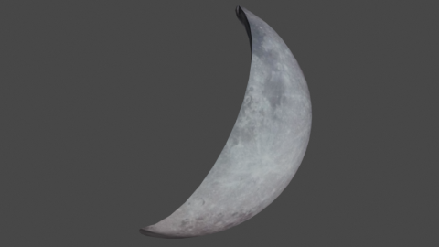

#### CrescentMoonYellow.fbx
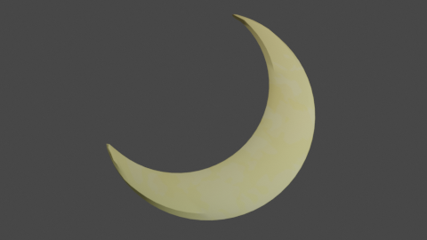

#### DendenDaiko.fbx
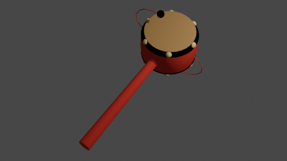

#### Joro.fbx
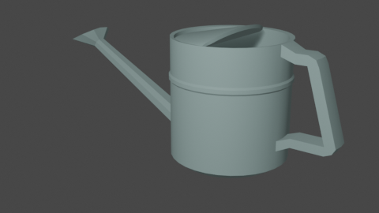

#### kadomatsu.fbx
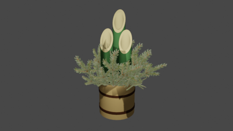

#### kama-small.fbx
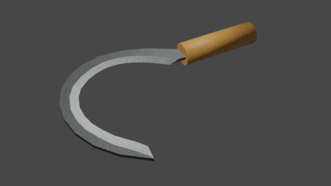

#### MetalBucket.fbx
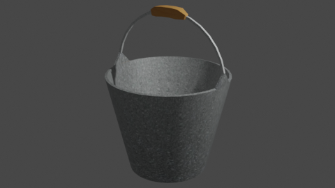

#### Planet.fbx
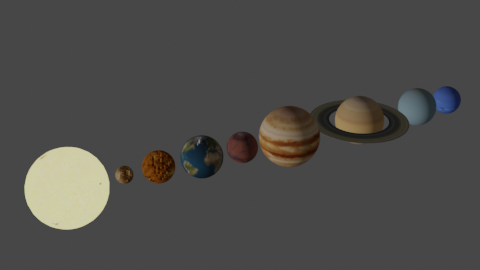

#### sansui.fbx
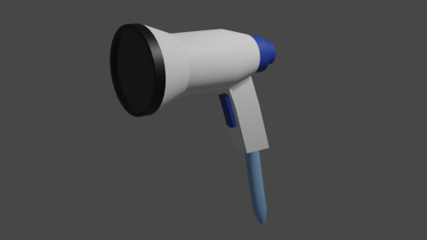

#### tawara.fbx
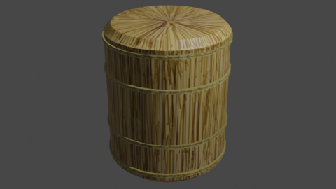

#### UFO.fbx [テクスチャどうにかしたい]
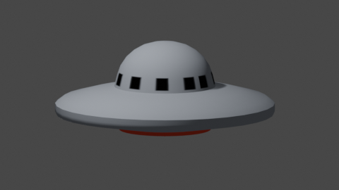

#### Wing.fbx
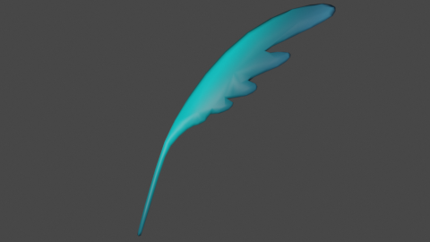


### アイトラッカー班

#### gun.fbx
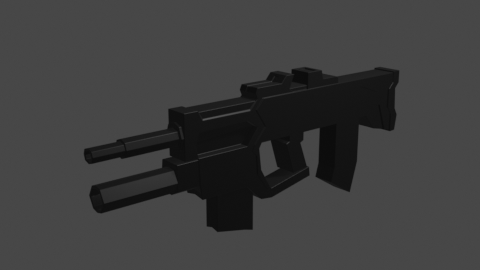

## 開発環境

Blender 2.80 for Windows

## テクスチャ引用元

* 木目テクスチャ : beiz (https://www.beiz.jp/%E7%B4%A0%E6%9D%90/%E6%9C%A8%E7%9B%AE/)

* 金属テクスチャ : beiz (https://www.beiz.jp/%E7%B4%A0%E6%9D%90/%E9%87%91%E5%B1%9E/)

* 月テクスチャ : NASA (https://nasa3d.arc.nasa.gov/detail/as11-44-6665)

* 黄色月テクスチャ : パブリックドメインQ (https://publicdomainq.net/crescent-moon-0011474/)

* 惑星テクスチャ : JHT's Planetary Pixel Emporium (http://planetpixelemporium.com/index.php)

---


## 問い合わせ先

モデルの作成依頼や修正依頼はDiscordで連絡ください。
そして、Trelloでタスクを発行してください。

Rinadehi
* Discord ID : Rinadehi#5950
* Twitter ID : https://twitter.com/Rinadehi_Mie