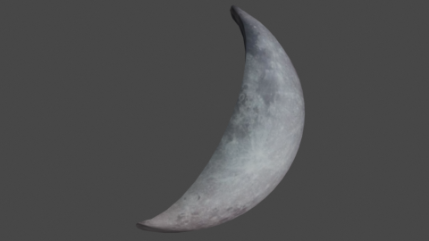

3Dアセットデータ置き場
====

中間ファイル含む 草刈りVR・脱出VRプロジェクト用3Dアセットファイル


## 使い方

このリポジトリは中間ファイルも含んでいるので、Unity読み込みの際は以下のようにFBXファイルのみのリポジトリからClone、Pullする。

```
cd [Unityプロジェクト]/Assets/
git clone https://git.calc.mie.jp/git/rinadehi/3DAssets-OnlyFBX.git
```


## フォルダ構成

```
├─EscapeVR : 脱出VR班用
├─EyeTracking : アイトラッカー班用
│   │  gun.fbx : 銃の3Dモデル
│   │
│   ├─blend : FBXエクスポート前のBlenderファイル置き場
│   └─image : レンダリング結果の画像置き場
└─GrassVR : 草刈りVR班用
    │  CrescentMoon.fbx : 三日月の3Dモデル[ボツ]
    │  CrescentMoonYellow.fbx : 三日月の3Dモデル   
    │  Joro.fbx : じょうろの3Dモデル
    │  kama-small.fbx : 小さなシックル型鎌の3Dモデル
    │  MetalBucket.fbx : 金属バケツの3Dモデル
    │  sansui.fbx : 散水ホースの3Dモデル
    │  tawara.fbx : たわらの3Dモデル
    │  UFO.fbx : UFOの3Dモデル
    │
    ├─blend : FBXエクスポート前のBlenderファイル置き場
    ├─image : レンダリング結果の画像置き場
    └─Textures : テクスチャ置き場
```

## 3Dモデルのレンダリングイメージ

### 草刈り班

#### CrescentMoon.fbx [ボツ]


#### CrescentMoonYellow.fbx


#### Joro.fbx


#### kama-small.fbx


#### MetalBucket.fbx


#### sansui.fbx


#### tawara.fbx


#### UFO.fbx [テクスチャどうにかしたい]


### アイトラッカー班

#### gun.fbx


## 開発環境

Blender 2.80 for Windows

## テクスチャ引用元

* 木目テクスチャ : beiz (https://www.beiz.jp/%E7%B4%A0%E6%9D%90/%E6%9C%A8%E7%9B%AE/)

* 金属テクスチャ : beiz (https://www.beiz.jp/%E7%B4%A0%E6%9D%90/%E9%87%91%E5%B1%9E/)

* 月テクスチャ : NASA (https://nasa3d.arc.nasa.gov/detail/as11-44-6665)

* 黄色月テクスチャ : パブリックドメインQ (https://publicdomainq.net/crescent-moon-0011474/)

---


## 問い合わせ先

モデルの作成依頼や修正依頼はDiscordで連絡ください。
そして、Trelloでタスクを発行してください。

Rinadehi
* Discord ID : Rinadehi#5950
* Twitter ID : https://twitter.com/Rinadehi_Mie